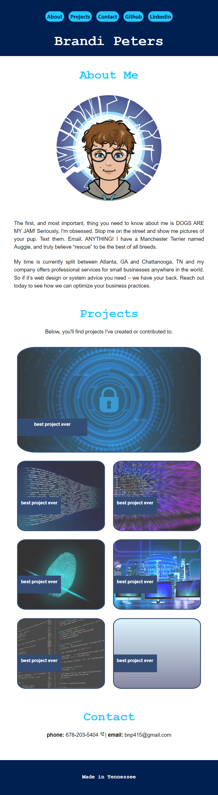
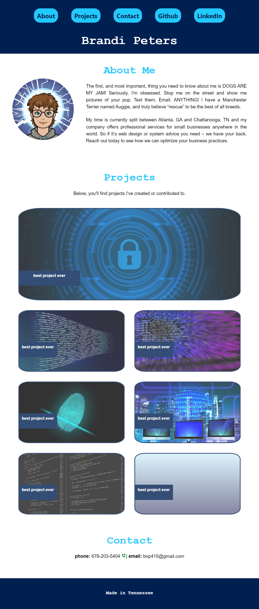
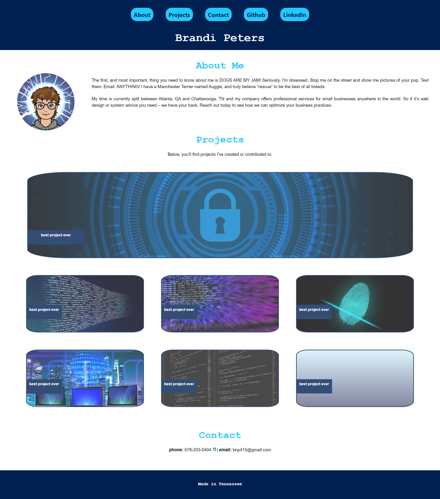

# portfolio

## Description

As someone making the career switch to tech, it's important to be able to showcase my skills for potential employers and/or freelance customers.

This project was extremely helpful in helping further my knowledge of HTML & CSS since it required me to start from scratch and build out a framework -- one that can be easily expanded as my skill set improves.

The bigest hurdles I encountered:
* choosing and implementing an appropriate nav bar and making it sticky
* taking the site from mobile first to any size screen responsiveness while keeping the content well organized and pleasing to the eye

## Usage

Each version based on screen size

## Credits

If you followed tutorials, include links to those here as well.

## License

MIT License

Copyright (c) 2022 bnicp